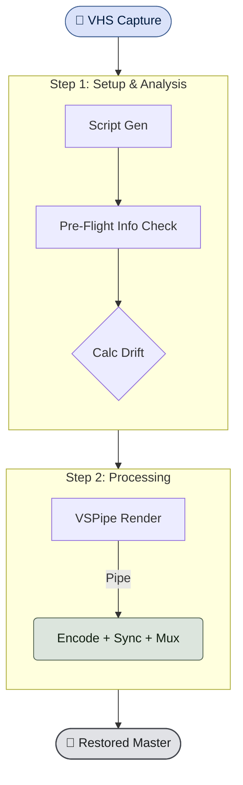

# Auto-VHS-Deinterlacer


Studio-Reference VHS Restoration Pipeline


Automated deinterlacing and audio synchronization tool for modernizing VHS
captures.

## 🛠️ Restoration Pipeline


```mermaid
flowchart TD
    %% Styling
    classDef input fill:#DAE2F9,stroke:#3F5F91,stroke-width:1px,color:#001B3E,rx:10,ry:10;
    classDef process fill:#DCE5DD,stroke:#526350,stroke-width:1px,color:#101E10,rx:5,ry:5;
    classDef output fill:#E1E2E6,stroke:#44474E,stroke-width:1.5px,color:#1A1C1E,rx:10,ry:10;

    Input([📼 VHS Capture]):::input

    subgraph Step1 ["Step 1: Setup & Analysis"]
        direction TB
        Gen[Script Gen] --> Check[Pre-Flight Info Check]
        Check --> Drift{"Calc Drift"}
    end

    subgraph Step2 ["Step 2: Processing"]
        direction TB
        Render[VSPipe Render] -->|Pipe| Encode["Encode + Sync + Mux"]:::process
    end

    Output([💾 Restored Master]):::output

    Input --> Step1
    Step1 --> Step2
    Step2 --> Output
```

## ⚡ Hardware Optimization

This tool automatically detects high-end hardware (for example, RTX 5090 and
Ryzen 9950X3D) to enable ULTRA profiles.

- CPU: Automatically scales threads to match your core count.
- RAM: Automatically adjusts cache based on available memory.

## 🚀 Usage

1. Install once:
   - Right-click `.\install.ps1` and choose Run with PowerShell.
   - This creates a local, self-contained Python environment.
1. Run:
   - Drag and drop your video file (or folder) onto `start.bat`.
   - Or double-click `start.bat` and drop files into the window.
1. Configure:
   - Edit `config.yaml` to switch between `prores` and `av1`.

## 📋 Requirements

- Windows (tested on Windows 11)

## Why this exists

Capturing VHS is messy.

1. Deinterlacing is hard: Standard FFmpeg filters like yadif and bwdif lose
   temporal detail or introduce jagged edges.
1. Audio sync drift: VHS captures often report 30.00fps vs 29.97fps, causing
   audio drift by the end of a tape.

This tool solves both automatically.

## ✨ Features

- Studio reference reliability with a self-contained local Python environment.
- Archival-grade QTGMC defaults with configurable settings in `config.yaml`.
- Smart drift correction with adaptive thresholding.
- Lossless audio workflow with PCM, AAC, and FLAC options.
- ISO 8601 logging with millisecond precision and timezone offsets.
- Real-time progress with ETA, timestamp, and speed.
- Zero-loss pipeline from VapourSynth to FFmpeg.

## 🛠️ Development Requirements

- Windows 10/11
- Internet connection for first-time setup
- Python 3.12
- Coverage policy:
  Every Python module and total repo coverage must stay above 90%.
- Local pipeline:
  Run `.\run_pipeline_localy.ps1` before pushing.
- Dependency profiles:
  Local and CI validation use light dependencies only.
  Heavy CUDA and VapourSynth packages are reserved for production installs.

## 📦 Installation and Usage

1. Install one-time setup:
   - Right-click `.\install.ps1` and choose Run with PowerShell.
   - The script will:
     - Create a secluded `.VENV` environment.
     - Install main runtime dependencies and the `ml-heavy` group.
     - Install VapourSynth and initialize `.VENV\vs` runtime folders.
     - Install required QTGMC plugins with `vsrepo`.
     - Generate a `start.bat` launcher.
1. Run:
   - Method A: Drag and drop files onto `start.bat`.
   - Method B: Double-click `start.bat` and drop files into the prompt.
1. Processing:
   - The tool initializes, verifies hardware, and starts batch processing.
   - Outputs are saved beside source files with `_deinterlaced` suffixes.

## 🧠 Technical Details

The script generates a VapourSynth script (`.vpy`) on the fly with defensive
plugin loading.

1. Ingest: Load video via FFMS2.
1. Processing: Apply QTGMC Placebo and archival settings.
1. Single-pass processing:
   - Efficiency: Pipe video directly from VapourSynth to FFmpeg.
   - Sync: Calculate drift before encoding and apply `atempo` as needed.
   - Encoding:
     - ProRes 422 HQ (10-bit) for archival.
     - Optional AV1 for high-efficiency output.

## 📄 License

MIT

## ✅ Local Quality Gate

Run the full local validation pipeline:

```powershell
.\run_pipeline_localy.ps1
```

This validates Ruff, Flake8, Pylint, Markdown linting, tests with coverage,
coverage threshold enforcement, and regeneration of `assets/coverage.svg`.
