# Auto-VHS-Deinterlacer

**Studio-Reference VHS Restoration Pipeline**

Automated deinterlacing and audio synchronization tool for modernizing VHS captures.

## 🛠️ Restoration Pipeline

```mermaid
flowchart TD
    %% Styling
    classDef input fill:#DAE2F9,stroke:#3F5F91,stroke-width:1px,color:#001B3E,rx:10,ry:10;
    classDef process fill:#DCE5DD,stroke:#526350,stroke-width:1px,color:#101E10,rx:5,ry:5;
    classDef output fill:#E1E2E6,stroke:#44474E,stroke-width:1.5px,color:#1A1C1E,rx:10,ry:10;

    Input([📼 VHS Capture]):::input

    subgraph Step1 ["Step 1: Setup & Analysis"]
        direction TB
        Gen[Script Gen] --> Check[Pre-Flight Info Check]
        Check --> Drift{"Calc Drift"}
    end

    subgraph Step2 ["Step 2: Processing"]
        direction TB
        Render[VSPipe Render] -->|Pipe| Encode["Encode + Sync + Mux"]:::process
    end

    Output([💾 Restored Master]):::output

    Input --> Step1
    Step1 --> Step2
    Step2 --> Output
```

## ⚡ Hardware Optimization
This tool automatically detects high-end hardware (e.g., **RTX 5090**, **Ryzen 9950X3D**) to enable **ULTRA** profiles:
- **CPU**: Automatically scales threads to match your core count (e.g., 32 threads for FFmpeg & VapourSynth).
- **RAM**: Automatically adjusts cache based on available memory (e.g., **35%** for 32GB systems, **50%** for 64GB+ systems).

## 🚀 Usage
1.  **Install** (Once):
    - Right-click `install.ps1` -> **"Run with PowerShell"**.
    - This creates a local, self-contained Python environment.
2.  **Run**:
    - **Drag & Drop** your video file (or folder) onto `start.bat`.
    - Or double-click `start.bat` and drop files into the window.
3.  **Config**:
    - Edit `config.yaml` to change between `prores` / `av1` or tweak hardware settings.

## 📋 Requirements
- **Windows** (tested on Windows 11)

## **🚀 Why this exists**

Capturing VHS is messy.

1. **Deinterlacing is hard:** Standard FFmpeg filters (yadif/bwdif) lose half the temporal resolution or jaggy edges.  
2. **Audio Sync Drift:** VHS captures often report 30.00fps vs 29.97fps, causing audio to drift seconds apart by the end of the tape.

This tool solves both automatically.

## **✨ Features**

* **Studio Reference Reliability:** Built on a self-contained, portable Python environment ensuring zero dependency conflicts.
* **Archival Grade QTGMC:** Uses `Preset="Very Slow"` with `SourceMatch=3` and `Lossless=2`. Defaults to pure deinterlacing (no denoising/sharpening), but configurable in `config.yaml`.
* **Smart-Drift Correction:** Enabled by default. Uses adaptive thresholding (absolute 10ms + relative 1.5%) to distinguish between true clock skew and container metadata jitter.
* **Lossless Audio Workflow:** Configurable support for **PCM (24-bit)** alongside AAC and FLAC, ensuring archival-grade, bit-perfect audio preservation.
* **ISO 8601 Logging:** Comprehensive audit logs with millisecond-precision timestamps and timezone offsets.
* **Real-Time Progress:** Visual progress bars with **ETA** (Estimated Time Left), current timestamp, and rendering speed.
* **Zero-Loss Pipeline:** Pipes raw YUV422P10LE video data directly from VapourSynth to FFmpeg.

## **🛠️ Requirements**
* **Windows 10/11**
* **Internet Connection** (For first-time setup only)
* **Python 3.10+**

### **Development Requirements**
* **90% Code Coverage**: Mandatory for all contributions. Enforced via CI/CD.
* **pytest**: Run `run_tests.ps1` to verify changes locally before pushing.

## **📦 Installation & Usage**

1. **Install (One-Time Setup):**
   - Right-click `install.ps1` and select **"Run with PowerShell"**.
   - This script will:
     - Create a secluded `.venv` environment.
     - Download and configure a portable VapourSynth R73 build.
     - Install all required QTGMC plugins automatically via `vsrepo`.
     - Generate a `start.bat` launcher.

2. **Run:**
   - **Method A:** Drag & Drop your video file (or folder of videos) directly onto `start.bat`.
   - **Method B:** Double-click `start.bat` and drop files into the interactive window.

3. **Processing:**
   - The tool will initialize, verify hardware, and begin batch processing.
   - Outputs are saved in the same folder as the source file with a `_deinterlaced` suffix.

## **🧠 Technical Details**

The script generates a VapourSynth script (`.vpy`) on the fly with defensive plugin loading.

1. **Ingest:** Loads video via FFMS2 (robust indexing).
2. **Processing:** Applies QTGMC (Placebo/Archival settings).
3. **Single-Pass Processing:**
   - **Efficiency:** Pipes video directly from VapourSynth to FFmpeg (`Pipe -> Encode`).
   - **Sync:** Calculates audio drift *before* encoding begins. Applies `atempo` filters dynamically during the single pass.
   - **Encoding:**
     - **ProRes:** Encodes to ProRes 422 HQ (10-bit) for archival.
     - **AV1:** Optional high-efficiency encoding (configurable).

## **📄 License**

MIT
